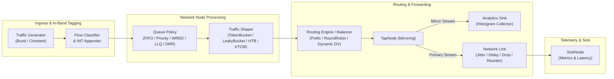

# NetForge-Core: System Architecture

NetForge-Core is a deterministic, discrete-event network traffic simulator written in modern Java. It models packet transmission, queuing policies, traffic shaping algorithms, dynamic control-plane routing, network pathologies, and in-band telemetry across discrete time ticks.

---

## 1. High-Level Architecture



---

## 2. Core Abstractions & Interfaces

### 2.1. Tickable
`Tickable` is the fundamental timing contract for discrete-event components.
```java
@FunctionalInterface
public interface Tickable {
    void tick(long currentTick);
}
```
All nodes, links, traffic generators, and monitors implement `Tickable`, allowing the centralized `SimulationEngine` to advance simulated time in synchronized clock steps.

### 2.2. Packet
Packets are immutable records carrying transmission metadata:
```java
public record Packet(
    String id,
    int sizeBytes,
    long creationTick,
    int priority
) {}
```
- **`id`**: Unique string identifier (can carry encoded metadata such as INT hop traces or control plane payloads).
- **`sizeBytes`**: Payload volume in bytes, used for token consumption, deficit counters, and MTU flight tracking.
- **`creationTick`**: Timestamp used for latency calculations upon arrival at sink nodes.
- **`priority`**: Traffic class value (e.g., 9 for VoIP/Expedited, 8 for Control Plane, 1 for Bulk).

### 2.3. QueuePolicy
Pluggable queuing strategies manage packet buffering and eviction:
```java
public interface QueuePolicy {
    boolean enqueue(Packet packet);
    Optional<Packet> dequeue();
    int currentSize();
}
```

### 2.4. TrafficShaper
Ingress and egress traffic policing and shaping contracts:
```java
@FunctionalInterface
public interface TrafficShaper {
    boolean evaluate(Packet packet, long currentTick);
}
```

### 2.5. RoutingTable
Next-hop determination strategy:
```java
@FunctionalInterface
public interface RoutingTable {
    String route(Packet packet);
}
```

---

## 3. Simulation Flow & Lifecycle

1. **Registration Phase**: Nodes, generators, links, and monitors are registered with `SimulationEngine`.
2. **Clock Advancement**: For each discrete tick (`currentTick`):
   - **Traffic Generation**: Generators emit packets into ingress nodes.
   - **Queuing & Shaping**: Nodes buffer packets via their configured `QueuePolicy` and release packets subject to their `TrafficShaper`.
   - **Routing & Forwarding**: Forwarding paths resolve next-hops via `RoutingTable` or direct connections.
   - **Propagation & Delay**: `NetworkLink` instances store in-flight packets across `delayTicks` before delivering to downstream targets.
   - **Mirroring & Telemetry**: `TapNode` clones packets asynchronously to analytics pipelines without impeding primary transmission.
   - **Egress Metric Collection**: `SinkNode` and `LatencyHistogramCollector` log latency percentiles (P50, P95, P99) and loss statistics.
